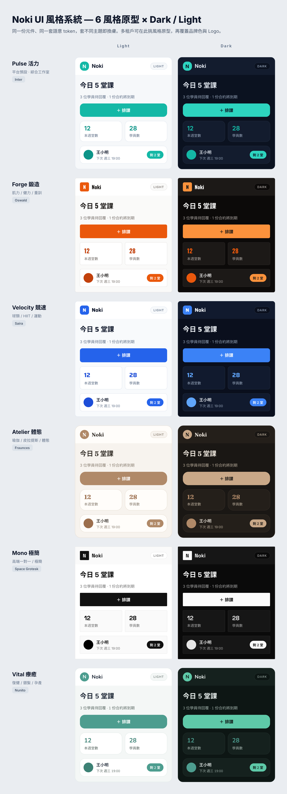
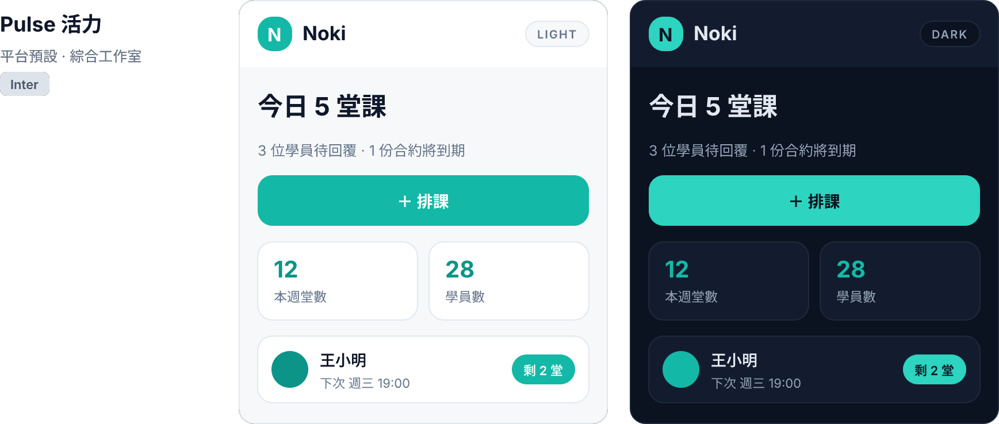
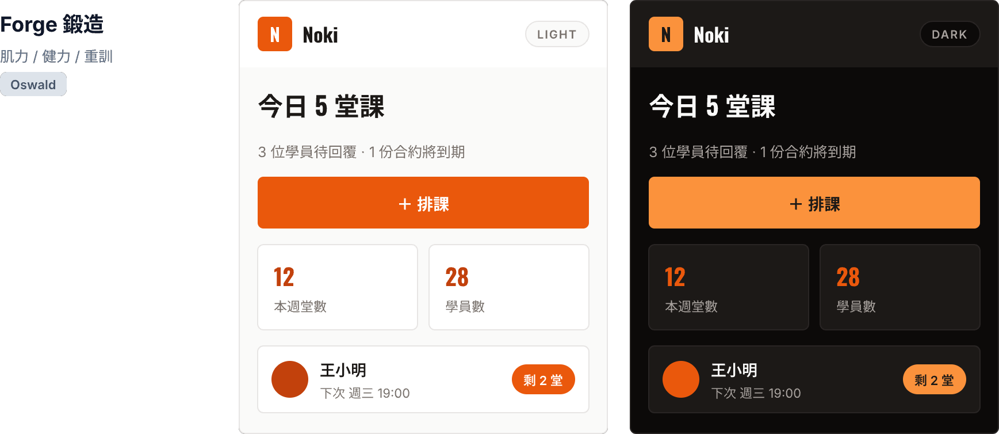
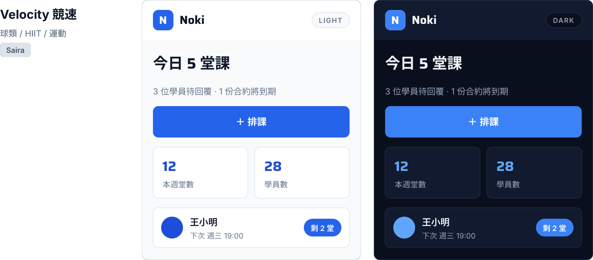
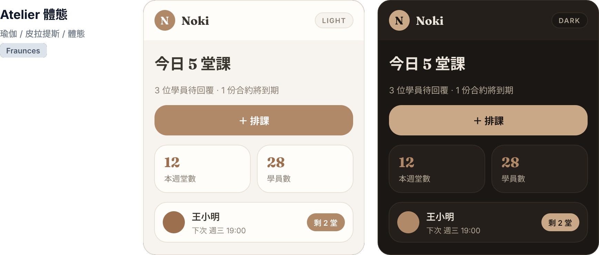
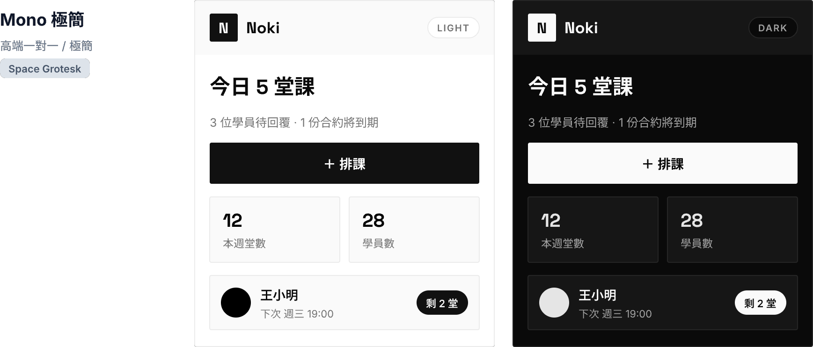
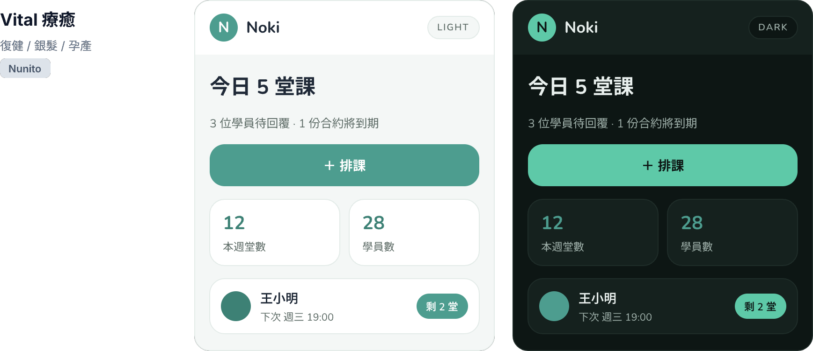

# Yolian UI 風格系統與多租戶品牌識別研究

> 專案：Yolian — 面向健身教練與個人工作室的營運平台
> 本文回答一個問題：**這個平台可以讓使用者自定哪些 UI 風格？** 並把它收斂成可實作的風格系統 —— 風格原型（Style Archetype）× 明暗模式（Dark/Light）× 多租戶品牌識別（Brand Identity）三個維度，定義每個維度可調什麼、由誰設定、套用到哪一面。
> 日期：2026-06-25 · 狀態：v1 待校準（文末有「待決策」）
> 關聯：`product-architecture.md` §4 產品三面、§5.1 實體（`Studio.品牌頁設定`、`Coach.個人頁`）；`deep-dive-competitors.md` §B（OneFloors 7 版型）

---

## 0. 為什麼風格要「可自定」（研究依據）

研究已直接驗證這條路，不是憑空假設：

- **OneFloors 7 種教練網站版型**（Ironclad 肌力健力 / Smash 球類競技 / Atelier 瑜伽體態 / Concrete 極簡黑白 / Velour 高階質感 / Verdant 療癒復健 / Voltage 能量競速）：7 種**共用同一資訊架構**，差異只在**配色與字體調性** → 印證「**選版型 + 填內容 = 自動生成**」是低成本、高感知價值的打法（見 deep-dive §B、§81、§86）。
- **品牌官網自動生成**有跨地需求：SimpleTraining（`simpletraining.co/品牌`）、Glofox、PT Distinction、17FIT「專屬品牌官網」都證明（competitor §350）。
- **白標**是國外明確賣點（SuperCoach、PT Distinction、Trainerize 高階、Glofox 白標 App 含基本價）。
- **多租戶的本質**就是品牌分離：每個 `Studio` 是一個租戶、每位 `Coach` 又有自己的個人品牌頁 → 平台天生需要「一份程式、多種外觀」。

> **收斂結論**：Yolian 的「可自定風格」= **可選風格原型（版型的本質）** + **品牌識別覆蓋（租戶自填）** + **明暗模式（使用偏好）**。三者正交組合，用同一套 token 疊出最終主題。這同時延續產品設計原則 #1（UI 與 Agent 共用動作層）的精神：**風格也是一套有型別的 token，不是散落各處的硬編碼色碼。**

---

## 1. 三個可自定的維度（總覽）

| # | 維度 | 是誰設定 | 改變什麼 | 主要套用面 |
|---|------|---------|---------|-----------|
| 1 | **風格原型 Style Archetype** | 租戶（Studio/Coach）從預設挑 | 整體視覺人格：色系基調、字體調性、圓角/陰影/密度 | 教練公開品牌頁（最強）、學員端 |
| 2 | **明暗模式 Dark / Light** | 終端使用者偏好（可跟隨系統） | 同一語意 token 換成亮版或暗版的值 | 全平台所有面 |
| 3 | **品牌識別資源 Brand Identity** | 租戶（Studio 為主、Coach 可覆蓋） | 品牌名、Logo、主色、字體、封面圖、網域… | 全平台，依面分輕重 |

```
       風格原型 (6 選 1)          品牌識別 (租戶自填)         明暗模式 (使用者)
   ┌──────────────────┐      ┌──────────────────┐     ┌──────────────┐
   │ Pulse / Forge /  │      │ 主色 / Logo /     │     │  Light       │
   │ Velocity / ...   │  ×   │ 字體 / 封面圖 ...  │  ×  │  Dark        │
   └──────────────────┘      └──────────────────┘     │  跟隨系統     │
            │                          │              └──────────────┘
            └──────────────┬───────────┘                     │
                           ▼                                  ▼
                 ┌─────────────────────────────────────────────┐
                 │         最終主題（一組解析後的 CSS tokens）      │
                 │   解析順序：Base → Archetype → Brand → Mode   │  ← §5
                 └─────────────────────────────────────────────┘
```

---

## 2. 六大風格原型（Style Archetypes）

> 設計法則承 OneFloors：**所有原型共用同一資訊架構與元件**，只換 token（色彩 / 字體 / 圓角 / 陰影 / 密度）。新增原型 = 新增一組 token map，不動版面與功能。
> 每個原型都對應 Yolian 研究中真實存在的教練類型，並同時提供 Light / Dark 兩版值。

> **以下風格模擬以 Pencil 實際繪製**：同一個 Yolian 學員端卡片元件（品牌標記／今日課表／排課按鈕／統計卡／學員列），套上不同主題即換膚 —— 印證「一份元件 × N 種主題」的可行性。原始檔：`design/yolian-styles.pen`（token 已存為主題化變數）。



### 2.1 Pulse 活力（平台預設）
- **定位 / 人格**：現代、親和、乾淨。Yolian 的中性預設，誰都不出錯。
- **對應**：綜合工作室、一般私教、尚未決定品牌調性的新租戶。
- **字體**：系統無襯線（Inter / -apple-system + PingFang TC）。
- **形狀質感**：圓角 12–14、柔和陰影、中等密度。
- **基底色**：青綠 Teal（沿用目前網站 `--accent:#14b8a6`，零遷移成本）。

| Token | Light | Dark |
|------|-------|------|
| accent | `#14b8a6` | `#2dd4bf` |
| accent-strong | `#0d9488` | `#14b8a6` |
| ink（主文字） | `#0f172a` | `#e2e8f0` |
| bg（底） | `#f6f8fa` | `#0b1220` |
| card（卡面） | `#ffffff` | `#131c2e` |
| line（分隔） | `#e2e8f0` | `#1e293b` |



### 2.2 Forge 鍛造（肌力 / 健力 / 重訓）
- **定位 / 人格**：工業、厚重、原始、高對比。鐵與火的語彙。
- **對應**：肌力健力、CrossFit、重訓私教（對標 OneFloors **Ironclad**）。
- **字體**：壓縮粗體標題（Oswald / Archivo Narrow / Teko），標題常用大寫。
- **形狀質感**：圓角 4–6（銳利）、硬陰影、高密度資訊。
- **基底色**：炭黑 + 熔岩橙。**預設偏好 Dark**。

| Token | Light | Dark（建議預設） |
|------|-------|------|
| accent | `#ea580c` | `#fb923c` |
| accent-strong | `#c2410c` | `#ea580c` |
| ink | `#1c1917` | `#fafaf9` |
| bg | `#fafaf9` | `#0c0a09` |
| card | `#ffffff` | `#1c1917` |
| line | `#e7e5e4` | `#292524` |



### 2.3 Velocity 競速（球類 / HIIT / 運動）★「運動」原型
- **定位 / 人格**：快速、動感、競技、能量。斜向、速度感。
- **對應**：球類競技、HIIT、團課、競速訓練（對標 OneFloors **Smash + Voltage**）。
- **字體**：動感無襯線、可帶斜體（Saira / Rajdhani / Archivo Expanded）。
- **形狀質感**：圓角 8 + 局部斜切、漸層、強調動態 hover。
- **基底色**：電光藍 + 萊姆綠輔色。Light / Dark 皆強勢。

| Token | Light | Dark |
|------|-------|------|
| accent | `#2563eb` | `#3b82f6` |
| accent-2（輔） | `#84cc16` | `#a3e635` |
| ink | `#0f172a` | `#f1f5f9` |
| bg | `#f8fafc` | `#0a0f1d` |
| card | `#ffffff` | `#111a2e` |
| line | `#e2e8f0` | `#1e293b` |



### 2.4 Atelier 體態（瑜伽 / 皮拉提斯 / 體態雕塑）
- **定位 / 人格**：柔和、留白、雜誌感、精緻。
- **對應**：瑜伽、皮拉提斯、體態雕塑、孕產塑身（對標 OneFloors **Atelier**）。
- **字體**：襯線標題（Fraunces / Playfair / Cormorant）+ 輕量無襯線內文。
- **形狀質感**：圓角 16–20（柔）、大量留白、極淡陰影、低密度。
- **基底色**：暖紙白 + 陶土 / 鼠尾草。**預設偏好 Light**。

| Token | Light（建議預設） | Dark |
|------|-------|------|
| accent | `#b08968` | `#c9a888` |
| accent-strong | `#9c6f4e` | `#b08968` |
| ink | `#3a352f` | `#ece5db` |
| bg | `#f7f3ee` | `#1a1714` |
| card | `#fffdfa` | `#241f1a` |
| line | `#e8e0d5` | `#332c25` |



### 2.5 Mono 極簡（高端一對一 / 極簡主義）
- **定位 / 人格**：克制、精品、字體驅動、近乎黑白。
- **對應**：高端私教、一對一菁英教練、極簡品味的工作室（對標 OneFloors **Concrete + Velour**）。
- **字體**：Grotesk（Helvetica Now / Neue Haas / Inter 緊排），數字用等寬。
- **形狀質感**：圓角 0–2（方）、髮絲線邊框、無彩或單一點綴色。
- **基底色**：純黑白灰。

| Token | Light | Dark |
|------|-------|------|
| accent（= ink 系） | `#111111` | `#fafafa` |
| accent-strong | `#000000` | `#e5e5e5` |
| ink | `#0a0a0a` | `#fafafa` |
| bg | `#ffffff` | `#0a0a0a` |
| card | `#fafafa` | `#161616` |
| line | `#ebebeb` | `#262626` |



### 2.6 Vital 療癒（復健 / 銀髮 / 孕產 / 健康促進）
- **定位 / 人格**：溫和、可信、無障礙。最高易讀性。
- **對應**：物理治療 / 復健、銀髮族訓練、孕產、慢性病健康促進（對標 OneFloors **Verdant**）。
- **字體**：人文圓體（Nunito / Mulish / Source Sans）+ PingFang，內文字級偏大。
- **形狀質感**：圓角 14–18、更大點擊區、對比達 **WCAG AA+**、低視覺噪音。
- **基底色**：沉穩青綠。

| Token | Light | Dark |
|------|-------|------|
| accent | `#4d9d8f` | `#5ec9a8` |
| accent-strong | `#3d8175` | `#4d9d8f` |
| ink | `#1f2937` | `#e8efed` |
| bg | `#f4f7f6` | `#0d1614` |
| card | `#ffffff` | `#15211e` |
| line | `#e3ebe8` | `#1f2d29` |



### 對照表：Yolian 原型 ↔ OneFloors 版型

| Yolian 原型 | 對應 OneFloors 版型 | 教練類型 |
|----------|-------------------|---------|
| Pulse 活力 | （Yolian 新增，平台預設） | 綜合 / 一般私教 |
| Forge 鍛造 | Ironclad | 肌力健力 / 重訓 |
| Velocity 競速 | Smash + Voltage | 球類 / HIIT / 競速 |
| Atelier 體態 | Atelier | 瑜伽 / 皮拉提斯 |
| Mono 極簡 | Concrete + Velour | 高端私教 / 極簡 |
| Vital 療癒 | Verdant | 復健 / 銀髮 / 孕產 |

> 6 個原型把 OneFloors 7 版型的覆蓋面收斂進來（Smash/Voltage 合為 Velocity、Concrete/Velour 合為 Mono），再補一個平台中性預設 Pulse。

---

## 3. Dark / Light 主題模式

明暗是**獨立於原型的軸**：每個原型都已在 §2 同時定義 Light 與 Dark 兩組值，使用者可在三種設定間切換。

| 模式 | 行為 |
|------|------|
| **跟隨系統** | 讀 `prefers-color-scheme`，隨裝置/時間自動切（建議預設） |
| **強制亮 Light** | 永遠用亮版 |
| **強制暗 Dark** | 永遠用暗版 |

**規則**：
- 切換明暗**只換 token 的值，不換語意名**（`--ink`、`--bg`、`--card`…語意不變）→ 元件零改動。
- 暗色不是把亮色反相，而是各原型獨立調校的暗版（見 §2 表），確保品味與對比。
- 對比度目標 **WCAG AA**；Vital 原型要求 **AA+**。
- 原型可宣告「建議預設模式」：Forge 偏 Dark、Atelier 偏 Light；使用者仍可覆蓋。
- 品牌主色（§4）在暗模式下若對比不足，系統自動取同色相的較亮階替代（見 §5 護欄）。

---

## 4. 多租戶品牌識別資源（Brand Identity Kit）

> 對應實體：`Studio.品牌頁設定`、`Coach.個人頁`。**租戶階層**：`Studio` 設定為該租戶預設 → 旗下每位 `Coach` 可在自己的個人品牌頁**局部覆蓋**（個人 Logo / 主色 / 封面），未覆蓋者繼承 Studio。

| 資源 | 說明 | 格式 / 約束建議 | MVP |
|------|------|----------------|:--:|
| 品牌名稱 + Slogan | 顯示於側欄、公開頁、通知署名 | 純文字（名 ≤ 20 字） | ✅ |
| Logo（主） | 側欄、公開頁 Header | SVG 優先，或 PNG ≥ 2x（含透明） | ✅ |
| 標記 / Favicon | 行動端圖示、瀏覽器分頁 | 正方 SVG/PNG，512px | ◐ |
| **品牌主色** | 覆蓋原型 `accent`；驅動按鈕/連結/強調 | HEX；**系統校驗對比**（見護欄） | ✅ |
| 品牌輔色 | 次強調 / 圖表 | HEX（選填） | ◐ |
| 字體選擇 | 從平台預設字庫挑（非自由上傳，控品質與授權） | 列表單選（每原型有預設） | ◐ |
| 封面 / Hero 影像 | 公開品牌頁、學員端歡迎圖 | JPG/WebP ≥ 1600px；提供裁切框 | ◐ |
| 自訂網域 / Slug | `yolian.cc/coach/<名>` → 進階自訂網域 | slug 唯一；網域 = Phase 3 | ◐→Phase3 |
| 通知寄件識別 | Email / LINE 署名、頁首 | 文字 + Logo | Phase 1.5 |
| 學員端品牌開關 | 學員看到的是工作室品牌還是 Yolian | 布林 | Phase 2 |
| 預設明暗偏好 | 該租戶面向客戶頁的預設明暗 | Light / Dark / 跟隨 | ◐ |
| 自訂 CSS / 完整白標 | 移除 Yolian 標記、注入樣式 | 進階方案限定 | Phase 3 |

> **MVP 收斂**：先做「品牌名 + Logo + 品牌主色 + 選 1 原型」就足以生成有辨識度的教練公開品牌頁 —— 這正是 OneFloors「選版型 + 填內容」被驗證的最小集合。其餘逐期開。

---

## 5. 主題 Token 架構（怎麼組起來）

四層疊加，**後者覆蓋前者**，最終解析成一組 CSS variables。這與目前 `build_site.py` 的 `:root{ --accent … }` 寫法**完全相容**，是自然延伸而非重寫。

> **風格已存檔**：六原型 × 明暗的完整 token 矩陣已存為 Pencil 主題化變數於 `design/yolian-styles.pen`（兩條主題軸 `archetype` × `mode`，§2 各表的值即由此匯出）。此檔是設計端的單一事實來源，可直接匯出成前端 CSS variables 或 design token JSON。

```
解析順序（後蓋前）：

  ① Base 原始 token        色階 / 間距 / 圓角階 / 字級階（全平台固定的原物料）
        ↓
  ② Archetype 原型層       選 1 原型 → 決定「用哪些原料」：accent 取哪階、
                          圓角用幾、字體家族、陰影深度（§2）
        ↓
  ③ Brand 品牌覆蓋層        租戶填的 → 覆蓋特定語意 token：accent ← 品牌主色、
                          font ← 選定字體、logo / 封面（§4）
        ↓
  ④ Mode 明暗層            Light / Dark → 換 neutral / surface / ink 的值（§3）
        ↓
     最終主題（runtime CSS variables）
```

**語意 token 清單（建議起手集）**：

| 類別 | Token |
|------|-------|
| 色 | `--accent` `--accent-strong` `--accent-2` `--ink` `--muted` `--bg` `--card` `--line` |
| 狀態 | `--success` `--warning` `--danger` `--info` |
| 形 | `--radius` `--radius-lg` `--shadow` `--density`（緊/中/鬆） |
| 字 | `--font-display` `--font-body` `--font-scale` |
| 品牌資產 | `--logo-url` `--mark-url` `--cover-url` |

**護欄（品牌覆蓋的安全網）**：
- 品牌主色匯入時即時算與 `bg` / `card` 的對比；不足 AA 時，自動生成可用的 hover / on-accent 文字色，或提示租戶調整。
- 字體限**平台預設字庫**單選（非自由上傳）→ 控授權與載入效能。
- 自訂 CSS 僅限 Phase 3 白標方案，且沙箱化、不可覆蓋功能性樣式。

---

## 6. 套用範圍（四個面各吃多少品牌）

> 不是每一面都該「滿版品牌」。後台要功能優先、可讀；公開頁才需要最強的風格表現。

| 面（見 product §4） | 風格表現程度 | 說明 |
|--------------------|:-----------:|------|
| **面 1 教練後台**（結構化 UI） | 低–中 | 功能優先：吃 Logo + 品牌 accent + 明暗即可；版面密度不隨原型大改，避免影響效率 |
| **面 2 Agent 窗口** | 低 | 僅 accent + 明暗，保持對話可讀、跨原型一致 |
| **面 3 學員端**（Student App） | 高 | 學員看到的是**工作室品牌**（由 §4 開關決定）：原型 + 品牌色 + 封面全上 |
| **教練公開品牌頁 / 官網** | 最高 | 原型完整表現的舞台，對標 OneFloors 版型：Hero/方案/見證/FAQ/預約全部吃原型字體與配色 |

---

## 7. 分期路線圖

| 階段 | 風格能力 |
|------|---------|
| **Phase 0 MVP** | 預設 **Pulse** + **Light**；品牌基本集（名 / Logo / 主色）；公開品牌頁可**選 1 原型**。證明「選版型 + 填內容」跑通。 |
| **Phase 1.5** | **Dark mode** 全平台；**6 原型全開**；字體預設庫；通知寄件品牌識別。 |
| **Phase 2** | 學員端吃工作室品牌（含開關）；跟隨系統明暗；封面 / 標記資產；Coach 層覆蓋 Studio。 |
| **Phase 3** | 自訂網域、自訂 CSS、移除 Yolian 標記的**完整白標**（高階方案）。 |

---

## 8. 待決策（請校準）

1. **首發原型數**：MVP 先只給 **Pulse 1 個**（最快），還是直接放 **3 個**（Pulse / Forge / Atelier 覆蓋最常見三類教練）？
2. **Dark mode 進不進 MVP**：暗色雙倍 QA 成本；先只做 Light、Phase 1.5 補暗，可接受？
3. **學員端品牌歸屬**：學員看到「工作室品牌」會稀釋 Yolian 自身曝光（獲客 vs. 白標訴求的取捨）→ 預設給誰？是否做成方案差異（免費層露 Yolian、付費層可隱藏）？
4. **品牌主色自由度**：完全自由 HEX（最自由但易撞醜/低對比），還是限定**校驗過對比的色盤**？
5. **字體**：鎖平台預設字庫（控品質/授權/效能），還是高階方案開放自訂上傳？
6. **原型 vs. 自由調**：租戶只能「選原型」，還是可在原型上再細調圓角/密度等 token（彈性 vs. 一致性/維護成本）？

---

## 附：與既有文件的關聯
- `product-architecture.md` §4（產品三面 → §6 套用範圍）、§5.1（`Studio`/`Coach` 實體 → §4 品牌資源歸屬）、設計原則 #1（共用動作層 → §5 token 化的同源思想）
- `deep-dive-competitors.md` §B（OneFloors 7 版型 → §2 原型來源與對照）、§81/§86（選版型自動生成的低成本高感知驗證）
- `competitor-research.md` §350（白標 / 品牌官網自動生成需求 → §4、§7 Phase 3）
